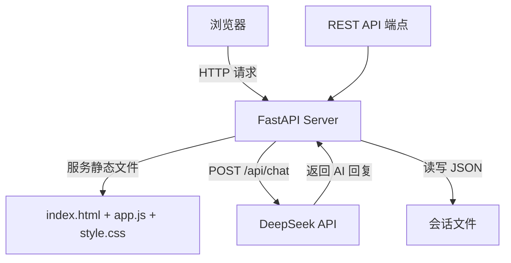

# 汉字迷盒 — AI 猜字谜游戏

[](https://python.org)
[](https://fastapi.tiangolo.com)
[](https://deepseek.com)

> **用 DeepSeek 大模型驱动的猜字谜互动游戏。**  
> AI 出题、判对错、给提示，全程只围绕字谜，不闲聊。

---

## 🎮 功能特性

| 功能 | 说明 |
|------|------|
| 🧩 **AI 出题** | DeepSeek 根据字谜知识库随机出题，覆盖组合、包含、半取、象形四种类型 |
| ✅ **自动判题** | AI 判断用户答案是否正确，零容错率 |
| 💡 **智能提示** | 答错时提供简短线索，不泄露答案 |
| 📚 **多会话管理** | 创建、加载、删除多个独立游戏会话 |
| 💾 **自动持久化** | 每次对话自动保存到 JSON 文件，随时恢复 |
| 🧠 **深度推理** | 启用 DeepSeek 的 thinking 模式，出题和判题更准确 |
| 🎯 **不重复出题** | AI 记住已用谜题，确保每轮新题 |

### 支持的谜题类型

| 类型 | 示例 |
|------|------|
| **组合类** | "一加一不是二" → 王 |
| **包含类** | "口里有口" → 回 |
| **半取类** | "半吃半拿" → 哈 |
| **象形类** | "三人都重逢" → 众 |

---

## 🚀 快速开始

### 前置条件

- Python 3.10+
- DeepSeek API 密钥（[申请地址](https://platform.deepseek.com/)）

### 安装

```bash
# 1. 安装依赖
pip install fastapi uvicorn openai

# 2. 设置 DeepSeek API 密钥
# Windows (PowerShell):
$env:DEEPSEEK_API_KEY = "你的API密钥"
# macOS / Linux:
export DEEPSEEK_API_KEY="你的API密钥"

# 3. 启动服务
python main.py
```

浏览器访问 `http://localhost:8000` 开始玩字谜。

---

## 🏗️ 技术架构



### API 端点

| 方法 | 路径 | 功能 |
|------|------|------|
| GET | `/` | 返回前端页面 |
| POST | `/api/sessions` | 创建新会话 |
| GET | `/api/sessions` | 获取会话列表 |
| GET | `/api/sessions/{session_id}` | 获取指定会话 |
| DELETE | `/api/sessions/{session_id}` | 删除会话 |
| POST | `/api/chat` | 发送消息给 AI |

---

## 🧪 代码结构

```python
main.py
├── 模块导入          — os, fastapi, openai, json, logging
├── 页面配置          — FastAPI app + StaticFiles mount
├── SYSTEM_PROMPT    — 详细的字谜游戏角色设定（7 条规则 + 4 类谜语示例）
├── API 端点
│   ├── POST /api/sessions  — 创建会话
│   ├── GET  /api/sessions  — 列出会话
│   ├── GET  /api/sessions/{id} — 获取会话详情
│   ├── DELETE /api/sessions/{id} — 删除会话
│   └── POST /api/chat      — AI 对话
├── 异常处理          — 全局 Exception Handler
└── 启动入口          — uvicorn.run()
```

---

## 🎯 System Prompt 设计亮点

与 AI Partner 不同，汉字迷盒的 System Prompt 针对 **猜字谜游戏** 做了专门设计：

1. **角色严格限定** — "只进行字谜互动，不闲聊无关内容"
2. **出题规则** — 随机出题、不重复、格式统一为"谜面（打一字）"
3. **判题规则** — "用户只回复一个字时，直接视为答案"，零容错
4. **互动流程** — 答对 → 夸奖+揭晓 → 问"要不要再来一题"
5. **严禁行为** — "绝对不要在回复中说'这个出过了，我换个新的'"

这种精细的 prompt 设计保证了 AI 的一致性和用户体验。

---

## 📄 文件结构

```
汉字迷盒/
├── main.py            ← 主程序 (FastAPI)
├── static/
│   ├── index.html     ← 前端页面
│   ├── app.js         ← 前端逻辑
│   └── style.css      ← 样式
└── sessions/          ← 会话数据（自动生成）
    └── *.json
```

---

## 🔗 关联项目

- [AI Partner](../ai-partner/README.md) — 个性化 AI 伴侣聊天应用，共享 DeepSeek API 调用模式
- [Prompt Engineering](../prompt-engineering/README.md) — 本项目的 System Prompt 设计思路在模板库中详细展开
