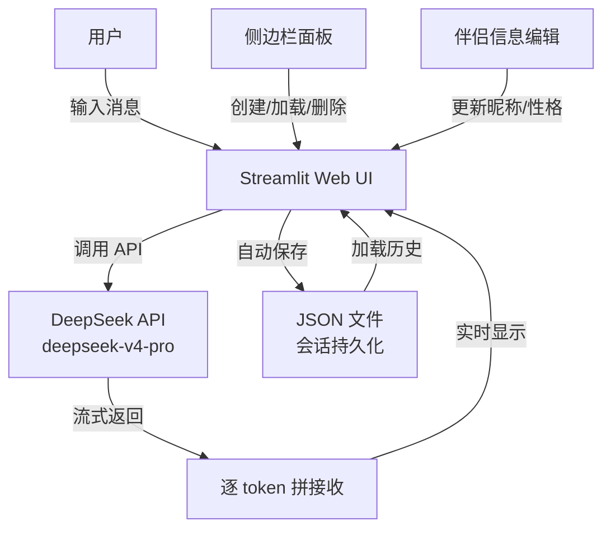

# AI Partner — 你的个性化 AI 伴侣聊天应用

[](https://python.org)
[](https://streamlit.io)
[](https://deepseek.com)
[](LICENSE)

> **用 Streamlit + DeepSeek API 打造一个能记住你是谁、陪你聊天的 AI 伴侣。**  
> 支持多会话管理、角色性格定制、流式输出、对话持久化。

---

## ✨ 功能特性

| 功能 | 说明 |
|------|------|
| 🗣️ **个性化角色** | 自定义 AI 伴侣的昵称和性格（如"活泼开朗的台湾妹妹"），对话风格随之变化 |
| 💬 **流式对话** | 逐 token 流式输出，打字机效果实时呈现，体验自然流畅 |
| 📚 **多会话管理** | 创建、加载、删除多个独立会话，互不干扰 |
| 💾 **自动持久化** | 每次对话自动保存到 JSON 文件，下次打开随时恢复 |
| 🧠 **深度推理** | 启用 DeepSeek 的 thinking 模式，回答更深入、更有逻辑 |
| 🎯 **会话记忆** | "滚雪球"式记忆——每次请求携带全部历史消息，上下文完整 |

---

## 🖼️ 效果预览

> 应用截图 —— 主界面 + 侧边栏控制面板

```
[应用截图] → 请在此处放置 assets/screenshots/main-interface.png
[多会话演示] → 请在此处放置 assets/screenshots/multi-session.png
```

---

## 🚀 快速开始

### 前置条件

- Python 3.10+
- DeepSeek API 密钥（[申请地址](https://platform.deepseek.com/)）

### 安装

```bash
# 1. 克隆仓库
git clone https://github.com/your-username/ai-partner.git
cd ai-partner

# 2. 安装依赖
pip install streamlit openai

# 3. 设置 DeepSeek API 密钥
# Windows (PowerShell):
$env:DEEPSEEK_API_KEY = "你的API密钥"
# macOS / Linux:
export DEEPSEEK_API_KEY="你的API密钥"

# 4. 启动应用
streamlit run ai_partner.py
```

启动后浏览器会自动打开 `http://localhost:8501`，开始与你的 AI 伴侣对话。

### 环境变量配置（推荐）

创建 `.env` 文件（需要安装 `python-dotenv`）：

```
DEEPSEEK_API_KEY=sk-your-api-key-here
```

---

## 🏗️ 技术架构



### 核心设计决策

| 决策 | 方案 | 理由 |
|------|------|------|
| 会话记忆 | "滚雪球"——每次全量发送历史消息 | 实现简单，上下文完整；适合会话 token 在可控范围内的场景 |
| 数据存储 | JSON 文件（按时间戳命名） | 零依赖，易于查看和调试，适合个人项目 |
| 流式输出 | `stream=True` + `st.empty()` 占位符 | Streamlit 原生支持，打字机效果体验好 |
| 角色定制 | System Prompt + `%s` 占位符填充 | 灵活度高，不改代码即可切换角色 |

---

## 🧪 代码结构

```python
ai_partner.py
├── 模块导入          — os, openai, streamlit, datetime, json
├── 页面配置          — st.set_page_config()
├── save_session()    — 保存会话到 JSON
├── create_session_file() — 生成时间戳文件名
├── save_creat_session()  — 列出所有历史会话
├── specify_session() — 加载指定会话
├── delete_session()  — 删除会话
├── 主界面            — 标题、聊天区域、输入框
├── 侧边栏            — 新建会话、历史列表、伴侣编辑
└── 核心对话逻辑       — System Prompt + API 调用 + 流式输出
```

详细的逐行代码分析请参见 [`ai-partner/ai_partner_analysis.md`](../ai_partner_analysis.md)。

---

## 📖 项目历程

这个项目是在 **Codex (GPT-5 驱动的 AI 编程助手)** 的协作下完成的。  
从最初的需求构思、代码实现，到逐行分析优化，整个过程记录了人机协作的完整闭环。

[查看完整协作过程记录 →](./协作过程记录.md)

---

## 🧠 投递/面试时可展开的技术话题

1. **流式输出实现** — 逐 chunk 拼接、st.empty() 占位符刷新、打字机效果的性能考量
2. **会话记忆方案** — "滚雪球" vs 滑动窗口 vs RAG 的取舍
3. **System Prompt 工程** — 角色代入的 prompt 设计、性格参数化
4. **多会话管理** — JSON 文件存储 vs 数据库方案的设计权衡
5. **人机协作开发** — 用 Codex/Claude 辅助开发的协作模式与效率

---

## 📄 License

MIT

---

## ✨ 致谢

- [DeepSeek](https://deepseek.com) — 提供强大且开放的 API
- [Streamlit](https://streamlit.io) — 让 Python 快速构建 Web UI
- [Codex](https://codex.so) — AI 编程伙伴，本项目全程在其协助下完成
